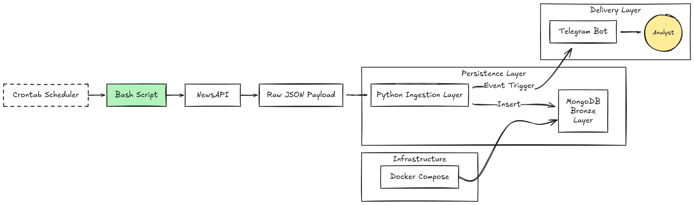

# Event-Driven Alert System for US Crypto Regulation

<p align="center">
  
  
</p>

## English

This project implements a **server-side data acquisition pipeline** designed to continuously monitor global news headlines for key terms related to US politics (e.g., Trump, US Government) and cryptocurrency markets (e.g., Bitcoin, Crypto).

The system runs autonomously using **Crontab** and combines **Bash scripting** and **Python**, leveraging **cURL** for API interaction and **Python-based ingestion** to persist the collected data into **MongoDB**. The database instance is provisioned via **Docker Compose**, ensuring a reproducible and isolated environment. The primary goal is to demonstrate a lightweight, resilient, and self-contained data pipeline capable of ingesting and storing volatile, time-sensitive information for subsequent analysis.

## Portuguese

Este projeto implementa um **pipeline de aquisição de dados no lado do servidor** projetado para monitorar continuamente manchetes de notícias globais em busca de termos-chave relacionados à política dos EUA (por exemplo, Trump, Governo dos EUA) e aos mercados de criptomoedas (por exemplo, Bitcoin, Cripto).

O sistema funciona de forma autônoma usando **Crontab** e combina **scripts Bash** e **Python**, utilizando **cURL** para interação com APIs e **ingestão em Python** para persistir os dados coletados no **MongoDB**. A instância do banco de dados é provisionada com **Docker Compose**, garantindo um ambiente isolado e reprodutível. O objetivo principal é demonstrar um pipeline de dados leve, resiliente e autossuficiente, capaz de ingerir e armazenar informações voláteis e sensíveis ao tempo para análises posteriores.

## Solution Architecture

The diagram below illustrates the end-to-end solution architecture, from scheduled data ingestion to persistent storage and real-time delivery.



## How to Use

### Prerequisites

You need the following installed on your Linux system:

* **Bash:** (Default on most Linux distributions)
* **cURL:** For making HTTP requests to the NewsAPI.
* **JQ:** For parsing and manipulating the returned JSON data.
* **Crontab:** For scheduling the script execution.
* **Docker-compose:** For initializing the MongoDB instance.

### Setup and Configuration

1.  **Clone the Repository:**
    ```bash
    git clone https://github.com/sbitencourt/jq-api-news-tracker.git
    cd jq-api-news-tracker
    ```
2.  **API Key Setup (.env):**  
    Obtain a free API Key from **NewsAPI**. Then, populate the `.env` file located in the `config/` directory:

    ```bash
    # config/.env
    NEWS_API_KEY="YOUR_API_KEY_HERE"
    ```
3. **Run docker-compose:**
   ```bash
   docker compose up -d
   ```
4.  **Grant Execution Permission:**  
    Ensure the main script is executable:
    ```bash
    chmod +x scripts/news_checker.sh
    ```
5.  **Determine Absolute Path (Crontab Reference):**  
    Run the script once to generate the path log. This file contains the exact absolute path required for Crontab configuration, guaranteeing portability across different machines:
    ```bash
    ./scripts/news_checker.sh
    ```
    The path will be saved in `config/news_checker_path.log`.
6.  **Crontab Scheduling:**  
    Edit your user crontab:
    ```bash
    crontab -e
    ```
    Add the execution line using the absolute path found in `config/news_checker_path.log` (e.g., `/home/user/projects/jq-api-news-tracker/scripts/news_checker.sh`).

    *Example (Running every 15 minutes):*
    ```crontab
    */15 * * * * /bin/bash [ABSOLUTE_PATH]/scripts/news_checker.sh
    ```

## API Constraints
If you opt to use the **Developer Plan (Free Tier)** of the News API — which was utilized for this project — please note the following critical limitations:

* **Rate Limit:** You are restricted to approximately **100 requests per day** (i.e., **1 request every 15 minutes**). The Crontab schedule must adhere to this.
* **Data Latency:** Articles returned by the API may have a **significant publishing date delay of at least 24 hours**. This means the API restricts the data window, making true "real-time" monitoring *not* achievable with this free plan.

> **❗ For projects requiring true real-time data or higher query frequency, upgrading your News API plan or utilizing an alternative, paid data provider is necessary.**
